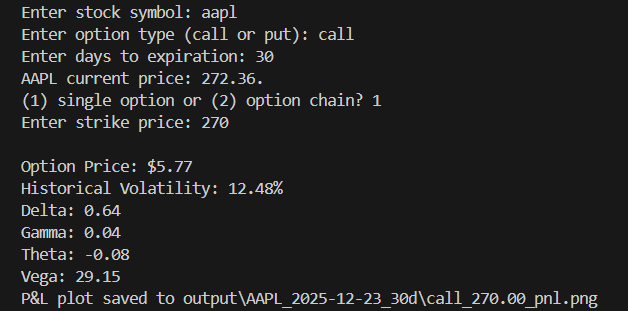
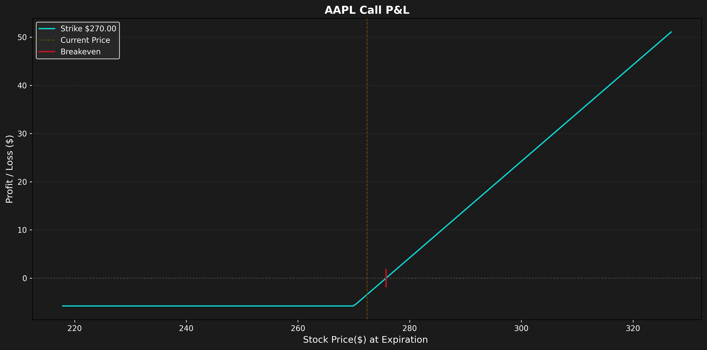
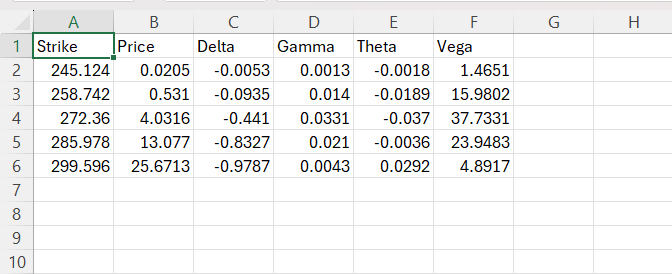
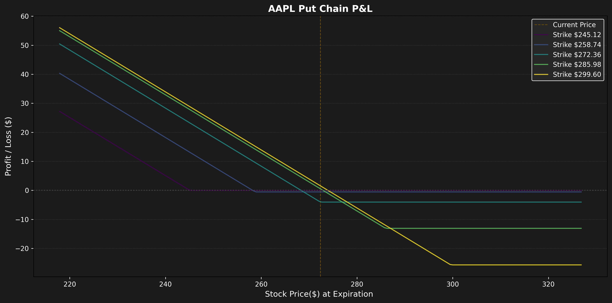
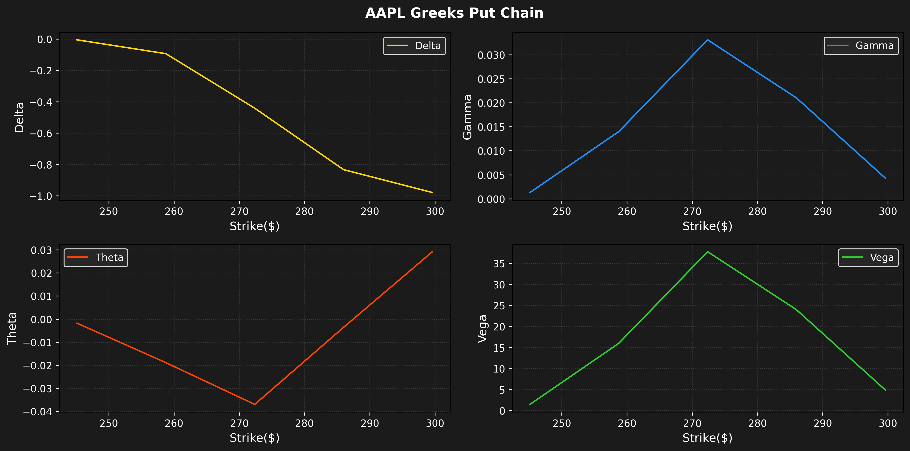

Author: Aidan Brinkley
email: aidanpb9@gmail.com

# Options Analyzer

A command-line tool for analyzing **European stock options** using the **Black-Scholes model**.  
Fetches market data with yfinance, estimates historical volatility, computes option prices, Greeks, and visualizes Greeks and P&L for single options or option chains.

## Features

- Fetches real-time stock prices and historical closing prices.
- Computes historical volatility (annualized) from the last month of data.
- Prices **call** and **put options** using Black-Scholes.
- Calculates option Greeks: delta, gamma, theta, vega.
- Generates P&L and Greeks visualizations for single options or entire option chains.
- Saves option chain CSVs and plots in a structured output directory.

## Requirements
- Python 3.10+
- Packages: listed in requirements.txt

## Running the program

1. Open your terminal/command prompt
2. Clone repo: `git clone https://github.com/aidanpb9/options-analyzer.git`
3. Open repo: `cd options-analyzer`
4. Make a venv (optional)
5. Install requirements: `pip install -r requirements.txt`
6. Run program: `python options_analyzer.py`
7. Follow the prompts:
    -Enter stock symbol (like AAPL or MSFT)
    -Enter days to expiration (e.g., 30)
    -Enter option type (call or put)
    -Choose 1 for single option, 2 for option chain
8. View results in the "output" folder, sorted by stock_date_expiration.

## Example outputs

**Single Option**:

**Option Chain**:

